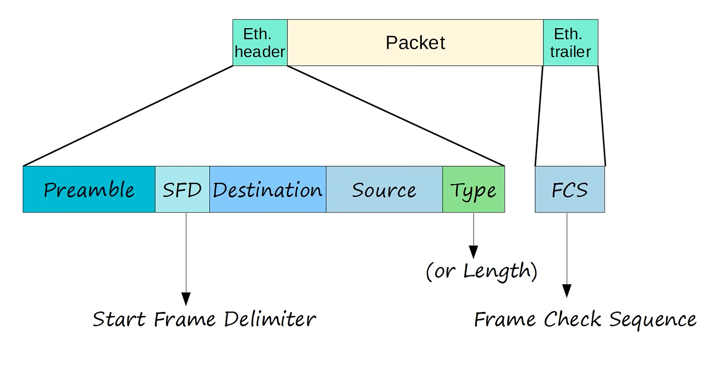
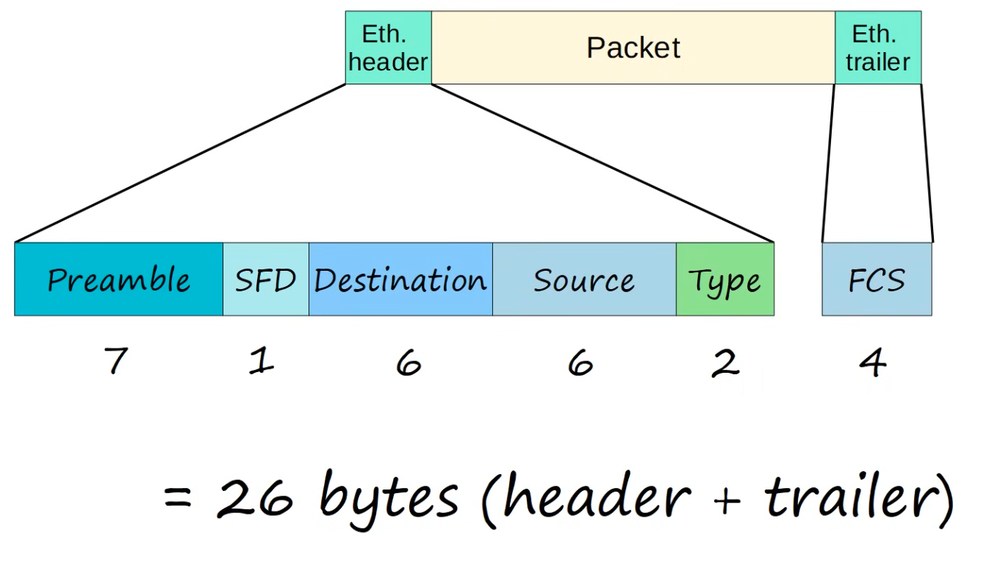

<h1>Ethernet LAN switching</h1>

<h2>Ethernet Frame</h2>

In this picture is the same like what we in the OSI's PDU, the ethernet frame is the Layer 2 frame on the PDU.

Here I am going to write down what actually happens within that frame.

Ethernet header 
 - Preamble = Used for clock synchronization at the receiving end.
     - Length: 7 bytes long (56 bits)
     - It's alternating 1's and 0's
         - Like 10101010 (1 byte) 7 times
 - Start Frame Delimiter (SFD) = Marks the end of the preamble and indicates the start of the actual frame data. 
     - Length: 1 byte (8 bits)
 - Destination MAC Address = The MAC address of the receiving device. 
 - Source MAC Address: The MAC address of the transmitting device. 
        (MAC = Media Access Control)
            - 6 byte (48-bit) address of the physical device.
 - EtherType (or Length) = Indicates the type of protocol being carried in the frame or the length of the data payload. 
     - 2 byte (16-bit) field
         - If the field has a value of 1500 or less, it indicates the LENGTH of the encapsulated packet (in bytes)
         - If the field has a value of 1536 or greater, it indicates the TYPE of the encapsulated packet (usually IPv4 or IPv6), and the length is determines via other methods like... 
             - IPv4 = 08x0800 (Hexadecimal)
                 - (2048 in decimal)
             - IPv6 = 08x86DD (Hexadecimal)
                 - (34525 in decimal)
 - Data (Payload) = The actual data being transmitted such as the "Packet" in the OSI's PDU.

Ethernet trailer
 - Frame Check Sequence (FCS) = Used for error detection
     - 4 bytes (32 bits) in length.
     - Detects corrupted data by running a 'CRC' algorithm over recieved data.
     - CRC = 'Cyclic Redundancy Check'

Here's a summerized picture on how many bytes each field has.

<h2>Mac Addresses</h2>
 
 - 6-byte (48-bit) Physical address assigned to the device when it is made
 - A.K.A. 'Burned-in Address' (BIA)
 - Is globally unique, no other device has the same MAC Address

<h2></h2>

<h2></h2>

<h2></h2>

<h2></h2>

