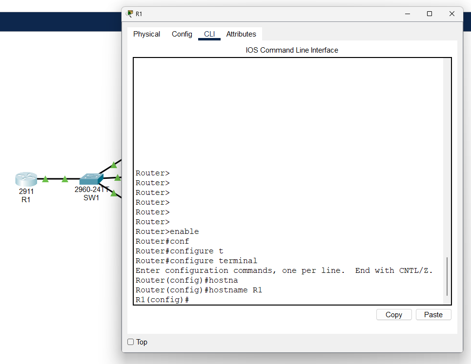
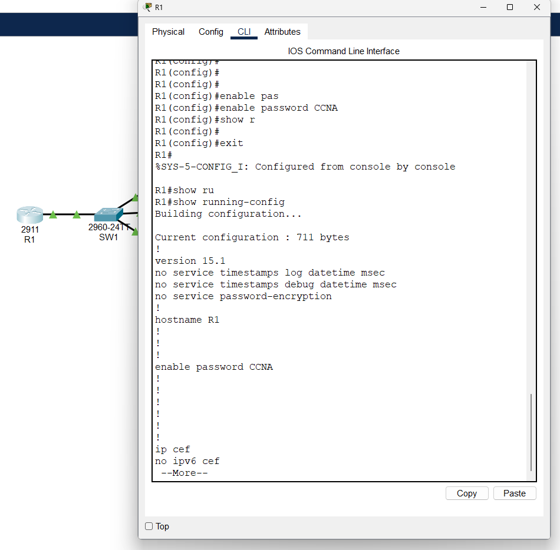
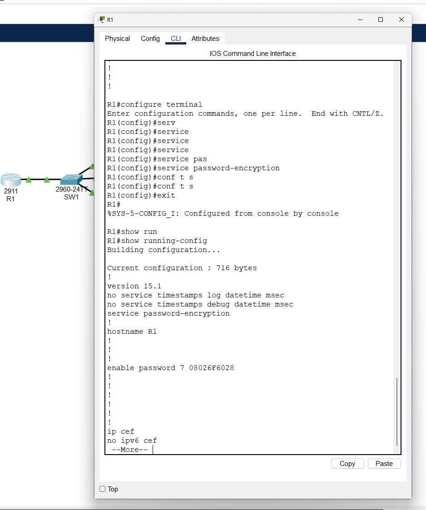
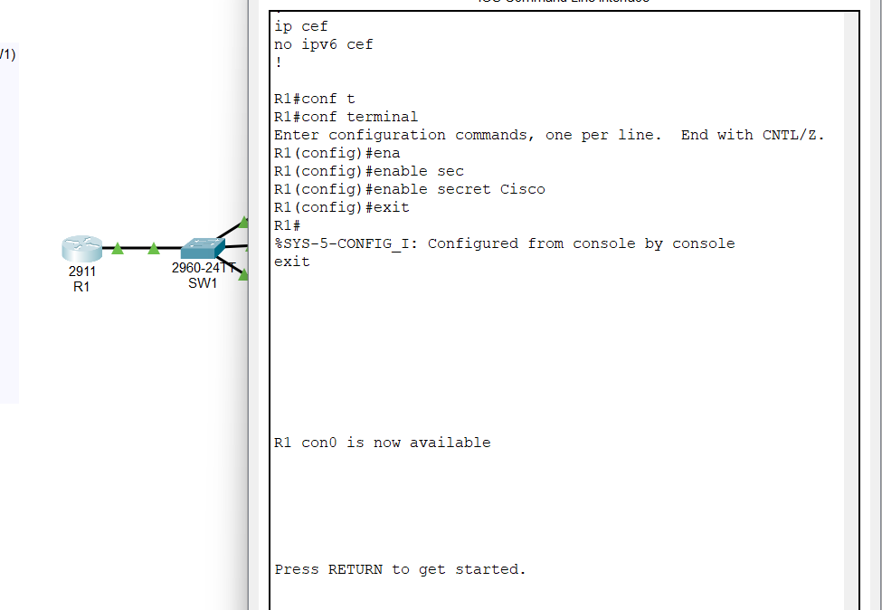
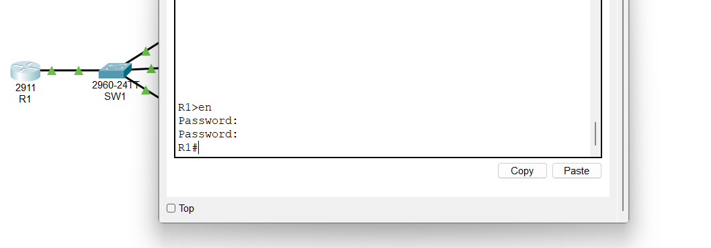
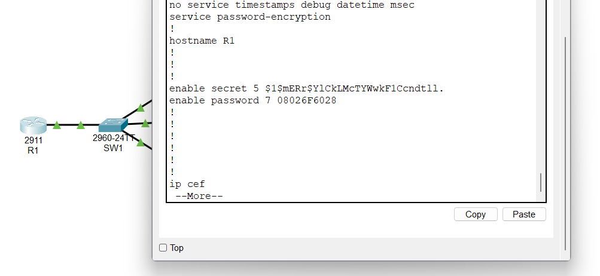
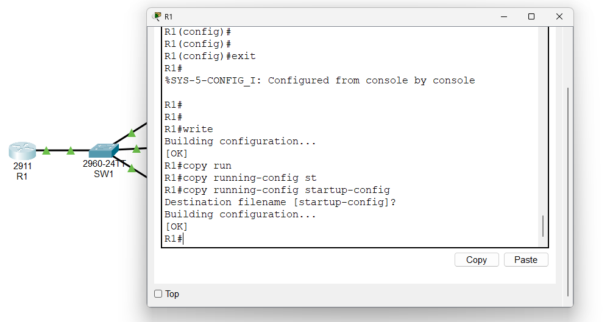

<h1>Basic Device Security</h1>
 
 This small project is a follow up to my CLI study for CCNA. 

First I changed the name of the router in the CLI

Next I added password to the CLI's privileged EXEC mode

 - shown the password by going into Priv exec and type in the "show running-config"

Here I added the type 7 password encryption by going into config mode and type "service password-encryption"

 - Shown again by using "show running-config"

For a more secure encryption I created a secret which should always be used.

Showing as an example that secret prioritizes over password-encryption command because the encryption is superior with "secret".
 - If secret get's enabled the normal "enable password -password" won't work.

 

Again, showing that it's enableed by using "show running-config"

Here I saved the running configuration and copied it and saved it as a startup config
