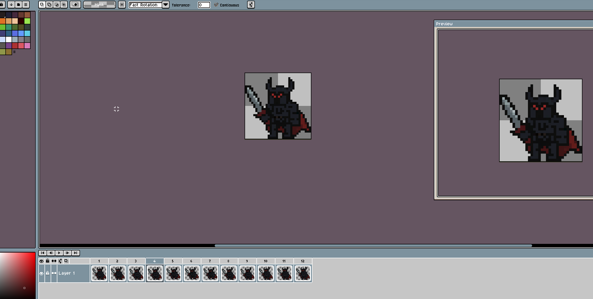
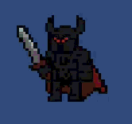

<h1>My 2d RPG</h1>

Here I am going to make a game that is a RPG like 2d game, I'm not planning to make it a long one it's more of a personal project that I want to try out for my self and discover how to create a RPG-like game.

I will be posting a update post here and a seperate section of all my C# code and gamefiles that I use for the game.

But before then, I have to create my own pixel sprites for my game. As I am more of a coder than a art designer, it's gona take me a while to finish the character.

<h1>Day 1: The first player!</h1>

If I'm going to make a game, the player has to play a character ofcourse, meet a sprite that I drew my self, that took a bit of a while to do!

I've been practicing using aseprite and create my own character, this is ofc not super original since I tried to find some knight sprite on the internet and then I added this "Dark knight" theme with horns and stuff, I like it so I will keep this for now (maybe update it later when I feel like it)

As u see underneath the picture, I created a idle animation that I learned on the way, it's not insanely detailed but I think it looks good enough, again... I am not much of making arts my self hehe.

<h2>Controls</h2>

Now that we created a character with a idle animation, I want to try it out.

And it works!
