<h1>My 2d RPG</h1>

Here I am going to make a game that is a RPG like 2d game, I'm not planning to make it a long one it's more of a personal project that I want to try out for my self and discover how to create a RPG-like game.

I will be posting a update post here and a seperate section of all my C# code and gamefiles that I use for the game.

But before then, I have to create my own pixel sprites for my game. As I am more of a coder than a art designer, it's gona take me a while to finish the character.

<h1>Update 1: The first player!</h1>

If I'm going to make a game, the player has to play a character ofcourse, meet a sprite that I drew my self, that took a bit of a while to do!

I've been practicing using aseprite and create my own character, this is ofc not super original since I tried to find some knight sprite on the internet and then I added this "Dark knight" theme with horns and stuff, I like it so I will keep this for now (maybe update it later when I feel like it)

As u see underneath the picture, I created a idle animation that I learned on the way, it's not insanely detailed but I think it looks good enough, again... I am not much of making arts my self hehe.

<h2>Controls</h2>

Now that we created a character with a idle animation, I want to try it out.

And it works! (Can't seem to make the Gif repeat on github, will check later)

Now here I am setting up the input actions using the input action editor, apparently there was a older one that is being depricated so I am trying out this new version, it looks simple and I assume that it will be a lot easier to code with.

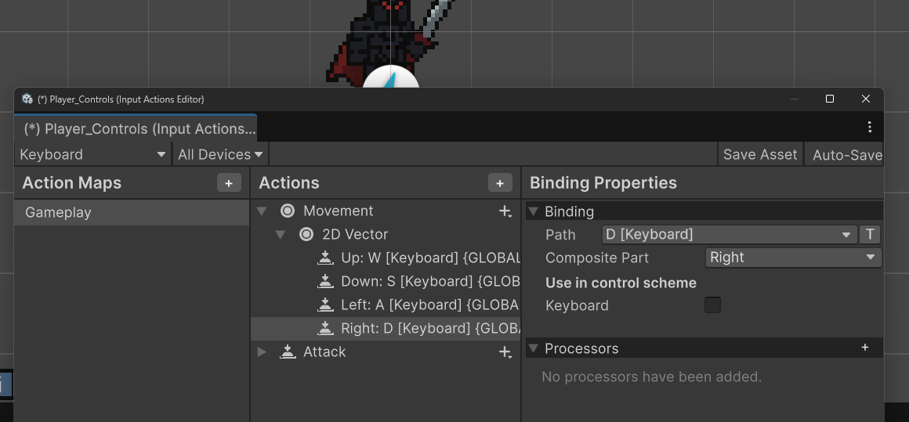

So I have gone over doing a lot of stuff trying to understand how they interact and understand the coding.
I begun by doing the settings to create inputs on the input manager
After that I did some research on coding how to connect them 2 together which is here

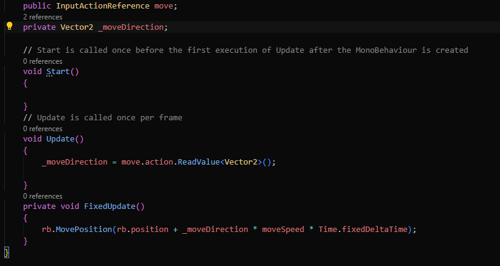

They have made it a fairly simplified coding needed from what I have previously seen in the past and I see why this is going to take over the old input manager.

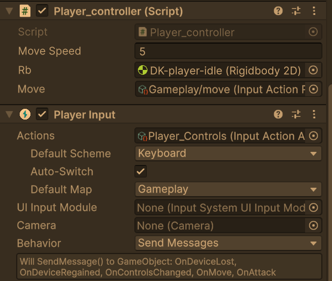

But after that I saved and connected the script to the player object and a new component(new for me) called "Player input". Supposedly supose to be a ease way of connecting the input to the player object. 

And Wollahh!

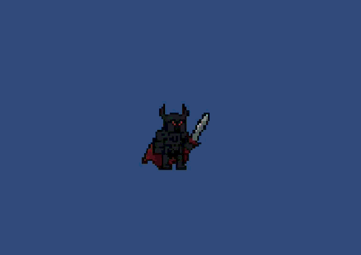

Not quite you were expecting right? I think it's cool seeing my Dark knight moonwalk like that hehe, but there's work to be done. It's pretty late now so I am going to call it for  today, next time I will be focusing on walking animations for my character. I am not going to go very in detail with art style related stuff and put most of my time on art, but I will try to make it as nice as possible.

<h1>Update 2: Adding new animations!</h1>

So not much has happened, I've been having more difficulty of thinking about something that is fun to make and I wasn't really sure about the dark knight thing. Though there is something that came up to mind and that is... What if... I make a 2d of one of my fav video game characters and then I got an IDEA!

<h2>Meet Malenia!</h2>

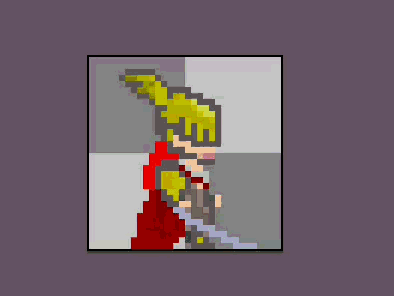

I really like the from software games and Elden ring is probably one of my fav games out there, so I thought... why not make a game about Malenia? That sounds so much more fun!

Problem is that I spent probably 5 hours learning new things on the sprite editor and it took me a while to no get used to and learn new things that was really handy to know beforehand. 

<h1>Update 3: New sprites, again</h1>

I was really excited of maybe doing the Elden ring theme'd 2D game but I didn't realize how much work it takes on the artistic side of the game. So I think I might delay that project later.

For now I just want to focus on coding and the acual game development and not worry about the art. So I have searched and I came across a free 2d sprite pack that I am going to use. Now I can actually start to focus only on game development!

Here is my new character!
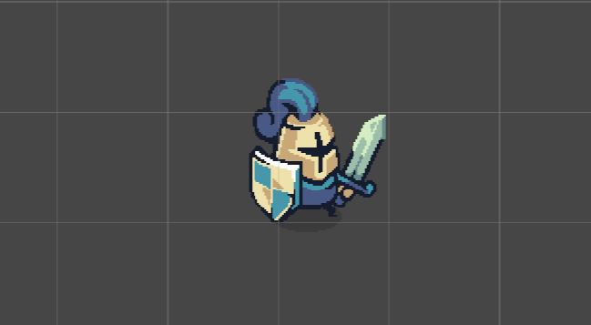

Like I did with my 2d character, I've created a new script and animation for this character

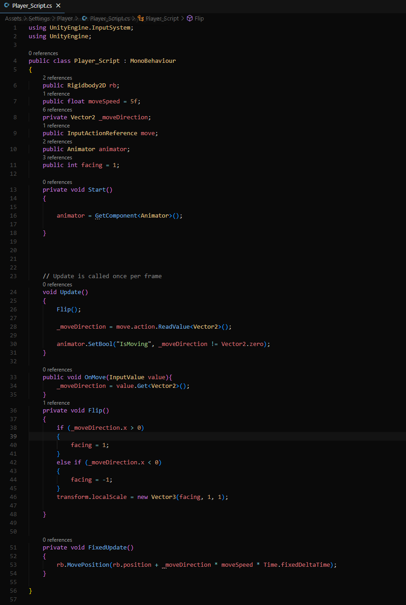

Explanation what I've done so far within the script starting from top to bottom

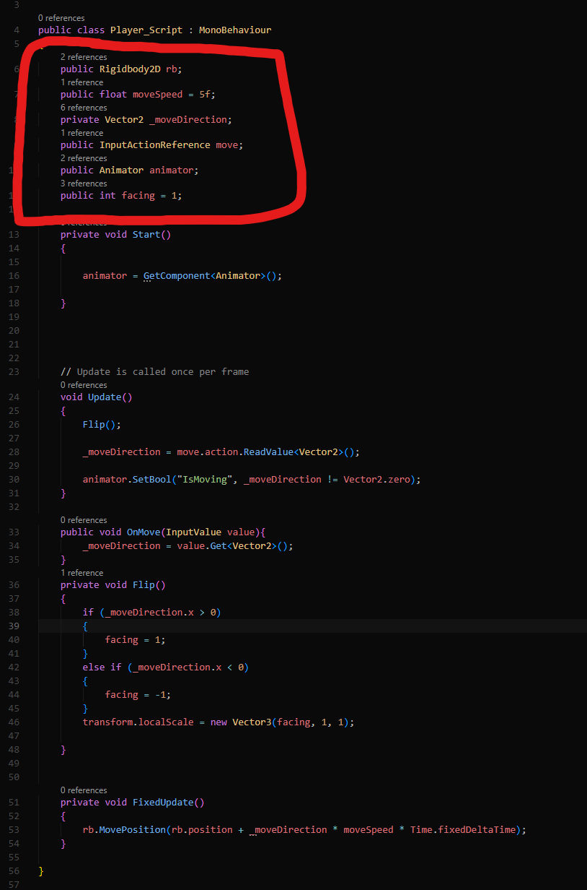
Here are couple of things and I'm going to explain what they do:

Rigidbody: is a script that is needed to define or link the player's rigidbody into the script

moveSpeed: Standard movement speed of the character, since it's public you can manually edit this within Unity's inspector

Vector2: Vector2 is a refrence to the 2d dimention, and in 2d there are only 2 directions which is X and Y. So since this is a 2d game the only movement you can do is up down or left and right, so easiest way to edit movement is by defining Vector2 as movement which is the _moveDirection.

InputActionRefrence: I am learning in this to use the newest input controler, and by using that you need a component called "player input" and have to have a input action settings.
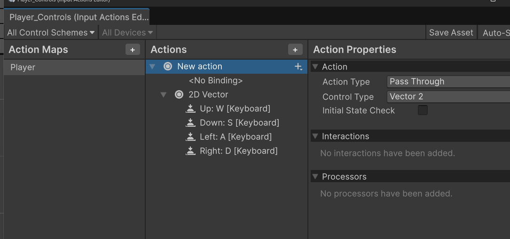
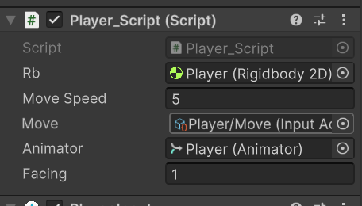

Animator: animator is needed to create the transition into a another animation, in this example I have only used walking so far.

Facing: Pretty simple, I have a script that faces the character to the same direction as where you are running.

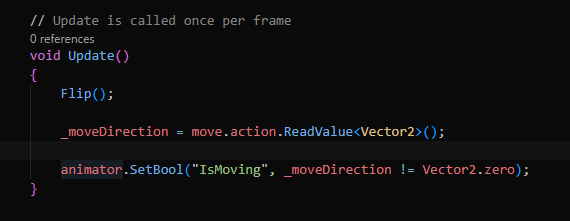

Flip(): I need to call flip once in here in order to create a seperate flip function

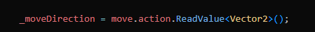
Is needed to read the value of vector2 for movement, it will come up later

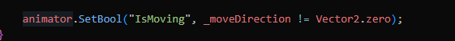
This is the animator transition that I use bool as a parameter here...
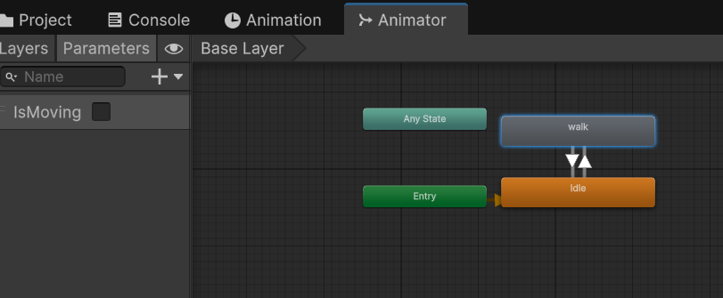
It's basically saying that the bool is always true unless the character is not moving, vector2.zero is a indicator that you're stable and not moving the value on vector(0,0)

Is the flip function, as mentioned above I made a int facing value, it starts being 1 and always face the right side at start. but here are the IF values depending if you walk left or right (x direction) if its a minus it's going left and positive value means right and then flips the character.
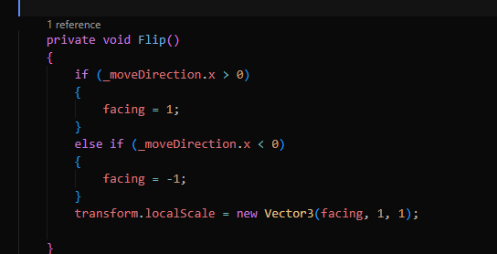

Here is the last one, regarding the movement of the physical body,
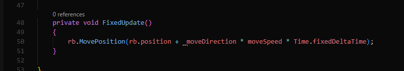
It moves the rigidbody's physical position depending on input, speed etc.