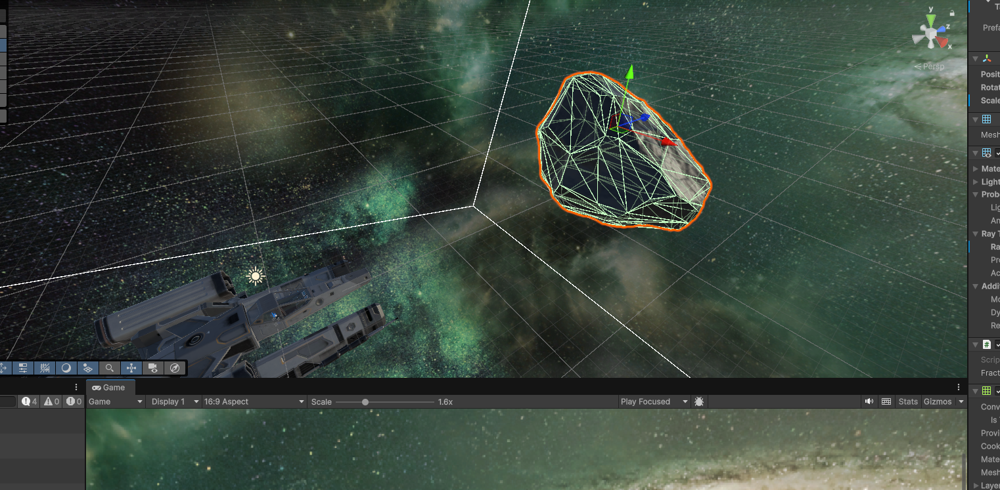
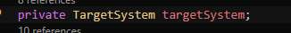
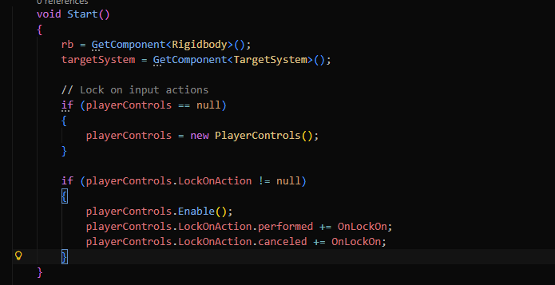
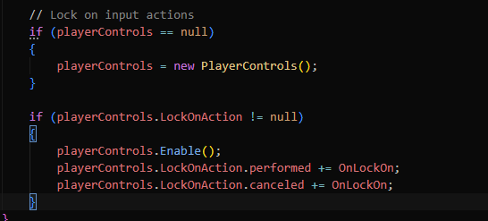
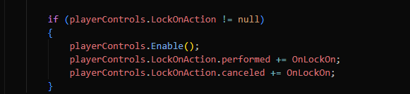
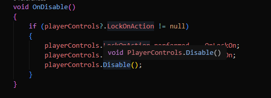
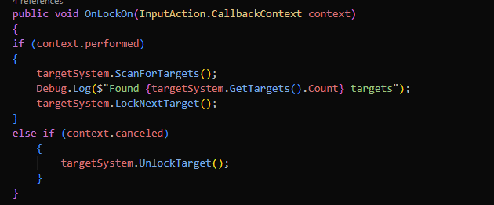

<h1>3d Space Game</h1>

Here I am working on a EVE inspired 3D game project, there's a lot more complexity with 3d controls after coming from 2d game so there's a lot to learn. I am excited to try out this project and hopefully able to make it work and build up the game. I will update as often as I can when I get some progress.

<b>----- Current Goal -----</b>
 
 -> Add Asteroids
 Create a inventory
 Create mining lasers, animation and add minerals in inventory
 Create enemy NPC's

<b>----- Last goal -----</b>
 
 Create Input controller (Trying to learn how to connect the new input controller system on unity w/ mouse control view)
 Add a skybox
 Create particles (star dusts) for ship when moving
 Create a ship controller script (Adding pitch force, thrust, roll etc...)
 Add a ship

<h2>Update 1</h2>

There were so many ways to add a skybox but it was a lot less complicated than it seemed. I started off figuring if I should create my own space but art is too time consuming by it self and AI didn't really work it out for me to create a simple skybox. So the easy way and I thought of it way too late to just get it out of the asset store.

Same way with the Spaceship, I got the asset from the asset store and added it in. I am not too bothered about art but it's the actual game developing that I want to focus on. If I'd think about materials and art too much I will have a lot less time to actually improve the game it self.

I adjusted the POV of the players camera and this is what it looks like for now

Moving on to the first script I added the ships controller

Added variable that will be used for the ships controller and it's default values, the higher the number the faster the movement is.
Above them is a serialized field that shows up on the scripts "inspector" tab inside unity. This is added to find the more ease of use when trying out the controllers and see what is the most comfortable speed.

Underneath all this you will find this

This is the variable or value that will determain if you go forward, left or right etc. depending on the players input.

And underneath that is this:

Here is where we will get the calculations of the speed with the input variable/value and I will explain how it works and use the thrust as an example:

1. Variable with a value of the speed of the thruster (moving forward)
    
    

2. A variable that determains if the ship is moving or not by using the floating number's range
    Example: 
    1 = Move forward
    0 = Neutral (not moving)
    -1 = Moving backwards

 

3. Here we use a math function called Approximately, its basically a bool that compares values together and returns true if they are similar. So in this case I used "!" so it means NOT
    So if it's NOT approximately 0f, then add force/torque on the rigidbody which is the player's gameobject.

    So in the script it's saying:
    If - the thrust is not 0 > then transform.forward (the indicator on blue axis which is forward)
    Under that is a calculation that is determined on the thursts force and the amount of in game time which is the time scale Time.fixedDeltatime.

    

After all that I added particles to be able to see if you're actually moving, having some stardust in the air. 

Can't see it on the screen because it's stationary but trust me it's there haha.

<h2>Update 2</h2>

We can fly! (Gif quality is bad sorry)

After many hours of trying to make it work, I finally found a way. 

Who would've known that one sneaky input control scheme could stop the whole thing from working. I had gone over so many different tutorials trying to understand why mine wasn't working and it turned out it was because of a control scheme that newbie me added a long while back since it was a global project controller scheme.

I don't have much more time on my hands atm but I will update this update here with the script that was created for the input controller

<h2>Update 3</h2>

I've added a asteroid gameobject that I used a free asset from the asset store.

Few things I added a long the way. I created a Asteroid tag for it because of maybe future idea, but I also added a "Enemy" layer to it because I had a new idea that I want to add a lock on system, since it's a EVE inspired I wanna try to make a similar system to that.

Not many tutorials how to make a Lock On system like EVE so I will have to do it blind with possible AI help and adjust to my liking. As much as I want to avoid using AI in projects for coding, I know that AI is going to become the best way for productivity and it will get better over time. As long as I can read and know what the code is doing and fix on AI's error it's actually a really good tool.

So if there is a case where I get AI's help I will do everything I can do explain in details what it does to show that I know what it's doing.

<h2>The target input</h2>

GetComponent is a way to get other "Components" inside different scripts.

if playerControls doesn't refer to anything, then create a new playerControl instance.

Here we are calling the refrence within the playerControl input action file saying if the button is pushed then it turns on and locks on.

Here's the opposite of it and cancel the targets lock on.

here's the function for the OnLockOn, So when the input action or the target button is pressed, it will scan for a target. atm I added a "LockNextTarget" whenever you have 2 targets then you can switch by pressing the target button again but I want to use tab to do it. For now I am not focusing on small things and want to work more on adding more major stuff in the game..

in the Else if section is basically sayingif there's no targets available then unlocktarget or cancel (not working yet properly)

I've added this debug option that helped me detect or see if the script was actually working. It shows in console saying if it found a target and with .count it tells how many targets are within target range (which will be explained in the next section)

Now for the actual target system.

<h2>Target System</h2>

