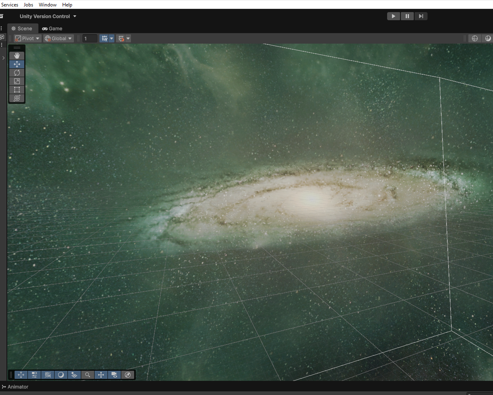
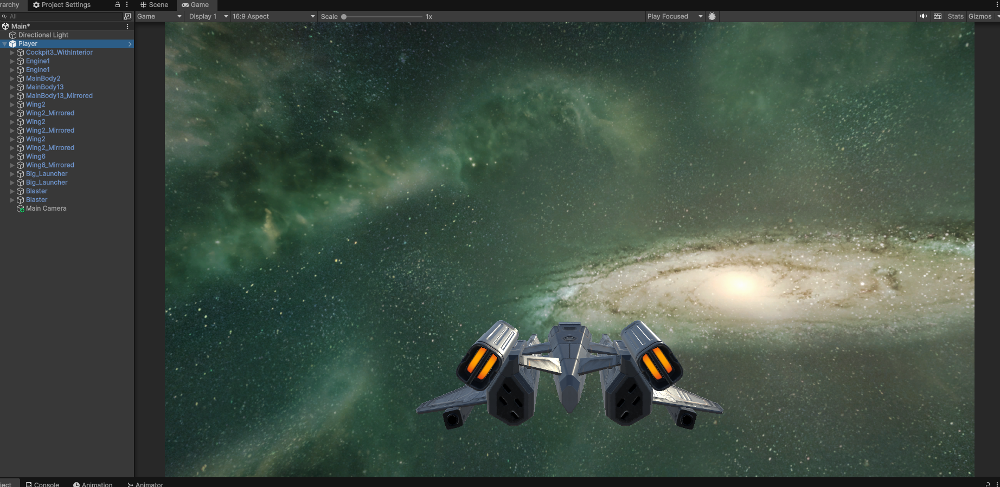
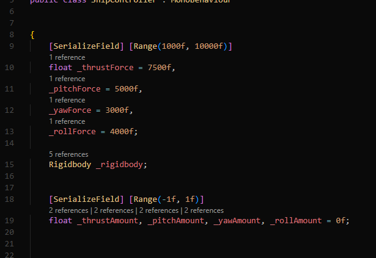
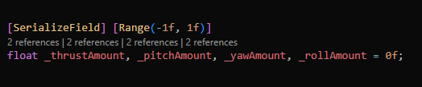
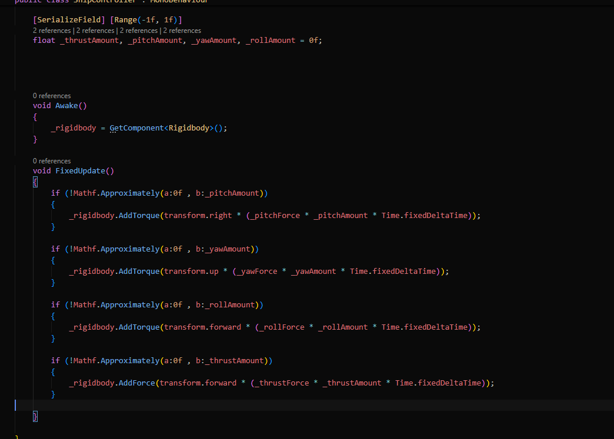
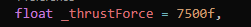
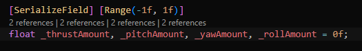
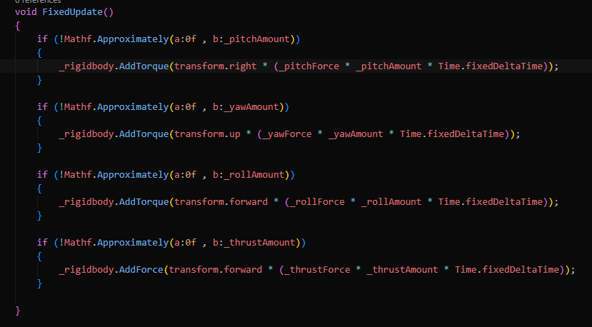
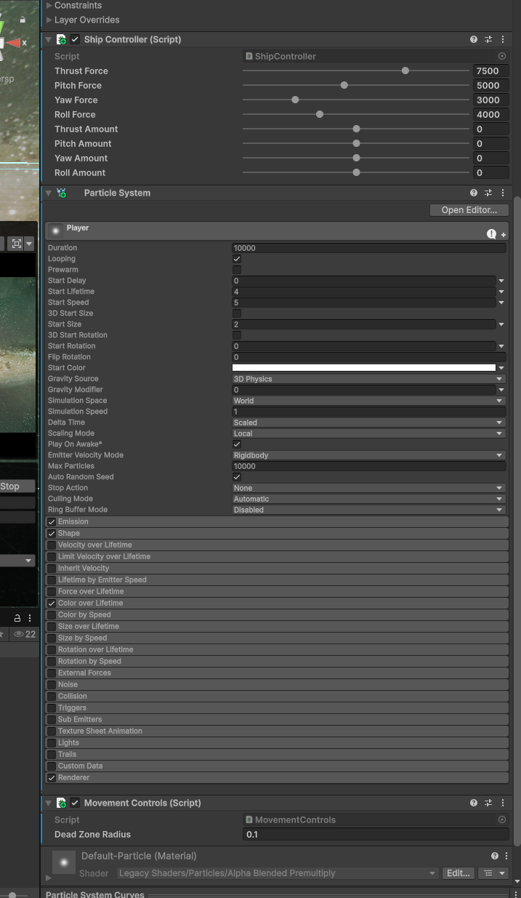

<h1>3d Space Game</h1>

Here I am working on a EVE inspired 3D game project, there's a lot more complexity with 3d controls after coming from 2d game so there's a lot to learn. I am excited to try out this project and hopefully able to make it work and build up the game. I will update as often as I can when I get some progress.

Current Goal:

-> Create Input controller (Trying to learn how to connect the new input controller system on unity w/ mouse control view)
Add Asteroids
Create a inventory
Create mining lasers and add minerals in inventory
Create enemy NPC's

Last goal:
Add a skybox
Create particles (star dusts) for ship when moving
Create a ship controller script (Adding pitch force, thrust, roll etc...)
Add a ship

<h2>Update 1</h2>

There were so many ways to add a skybox but it was a lot less complicated than it seemed. I started off figuring if I should create my own space but art is too time consuming by it self and AI didn't really work it out for me to create a simple skybox. So the easy way and I thought of it way too late to just get it out of the asset store.

Same way with the Spaceship, I got the asset from the asset store and added it in. I am not too bothered about art but it's the actual game developing that I want to focus on. If I'd think about materials and art too much I will have a lot less time to actually improve the game it self.

I adjusted the POV of the players camera and this is what it looks like for now

Moving on to the first script I added the ships controller

Added variable that will be used for the ships controller and it's default values, the higher the number the faster the movement is.
Above them is a serialized field that shows up on the scripts "inspector" tab inside unity. This is added to find the more ease of use when trying out the controllers and see what is the most comfortable speed.

Underneath all this you will find this

This is the variable or value that will determain if you go forward, left or right etc. depending on the players input.

And underneath that is this:

Here is where we will get the calculations of the speed with the input variable/value and I will explain how it works and use the thrust as an example:

1. Variable with a value of the speed of the thruster (moving forward)
    
    

2. A variable that determains if the ship is moving or not by using the floating number's range
    Example: 
    1 = Move forward
    0 = Neutral (not moving)
    -1 = Moving backwards

 

3. Here we use a math function called Approximately, its basically a bool that compares values together and returns true if they are similar. So in this case I used "!" so it means NOT
    So if it's NOT approximately 0f, then add force/torque on the rigidbody which is the player's gameobject.

    So in the script it's saying:
    If - the thrust is not 0 > then transform.forward (the indicator on blue axis which is forward)
    Under that is a calculation that is determined on the thursts force and the amount of in game time which is the time scale Time.fixedDeltatime.

    

After all that I added particles to be able to see if you're actually moving, having some stardust in the air. 

Can't see it on the screen because it's stationary but trust me it's there haha.