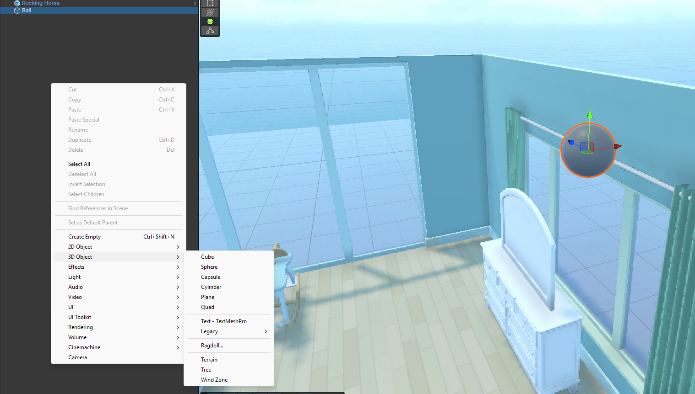
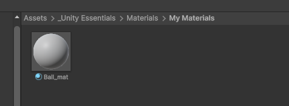
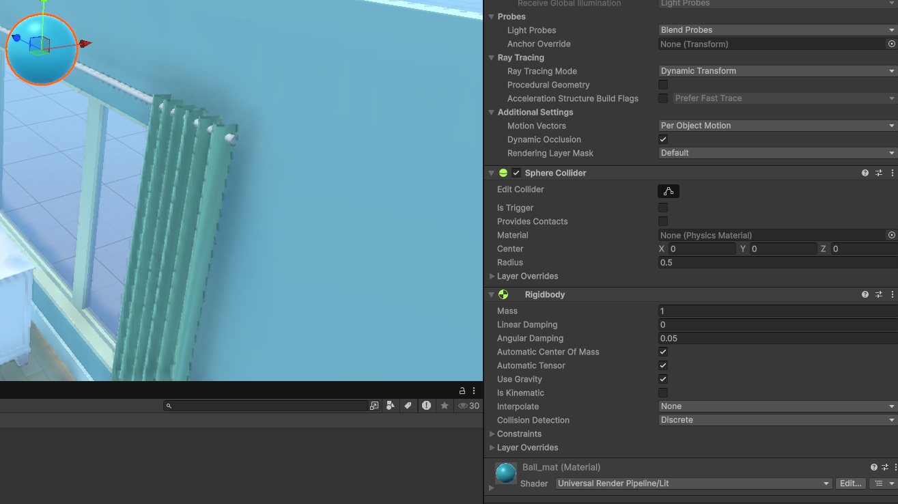
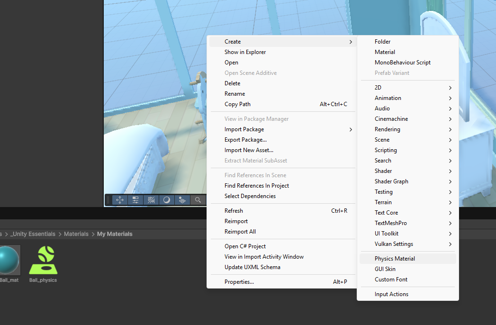
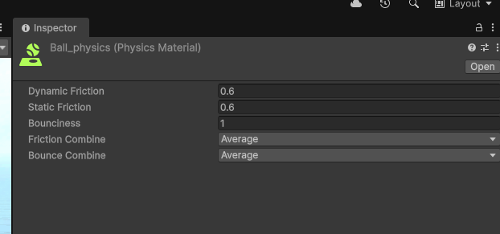
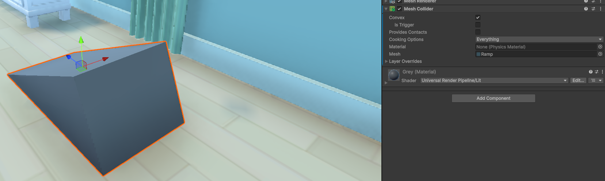

<h1>Creating physics</h1>

Here I created a room where I am going to make a bouncy ball with other interactions like if the ball hits blocks and they fall down. Unfortunately I won't be putting in the hassle of trying to create videos to show but I will note my step by step process
instead.

1. First I created the ball by going in the hierarchy > 3d objects > Sphere

2. Next I created a material asset for the ball so we can make all kinds of stuff like animations, scripts etc.

3. Here we change a bit of color on the ball and started adding the gravity into it by adding a component called "Rigidbody"
This way the ball won't float in the air but will have gravity affected to it.

4. Next we add the physics, here we can create the balls bounciness by going on our Material asset folder and Right click > Create > Physics Material

And then we drag the asset into the ball so it gets affected by the physics and it starts to bounce! (Again sorry, I don't know how to add videos on Github yet)

5. We're going to create now a ramp and add some colission physics, so when the ball hits the ramp it bounces off of it and moves in a different direction.
So here we added a ramp and with it we added a component called  a "Mesh collider" we use that in order to create the physical body on the asset so they can interact with other objects, otherwise the ball would just go right through the ramp.

