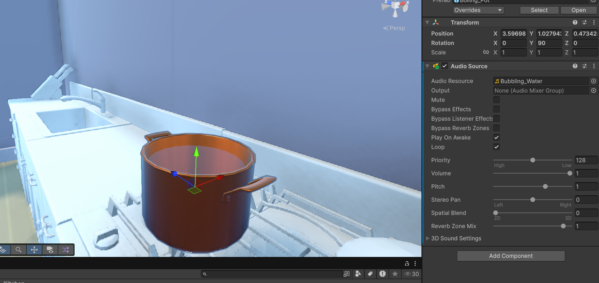

<h1>Creating soundscape</h1>

<h1>Adding proximity sounds</h1>

In this project I'm going to create a soundcape coming from objectives and add distances to the sounds depending how close you are.

1. In this I am going to add a pot with a boiling sound, I start by adding the object in to the game and add a audio source component with the bubbling water sound

2. Next we're going to want to add 3d audio to the sound by changing the spatial blend to 3D

<h1>Adding background music</h1>

1. You start by going into the hierarchy and right click > Create > Audio sound

There you can add your background music, as its a background music you'd want to keep it in 2D, if it was coming from example a radio in the game then you'd want the sound spatial blend to become 3D so that the sound becomes a proximity sound

