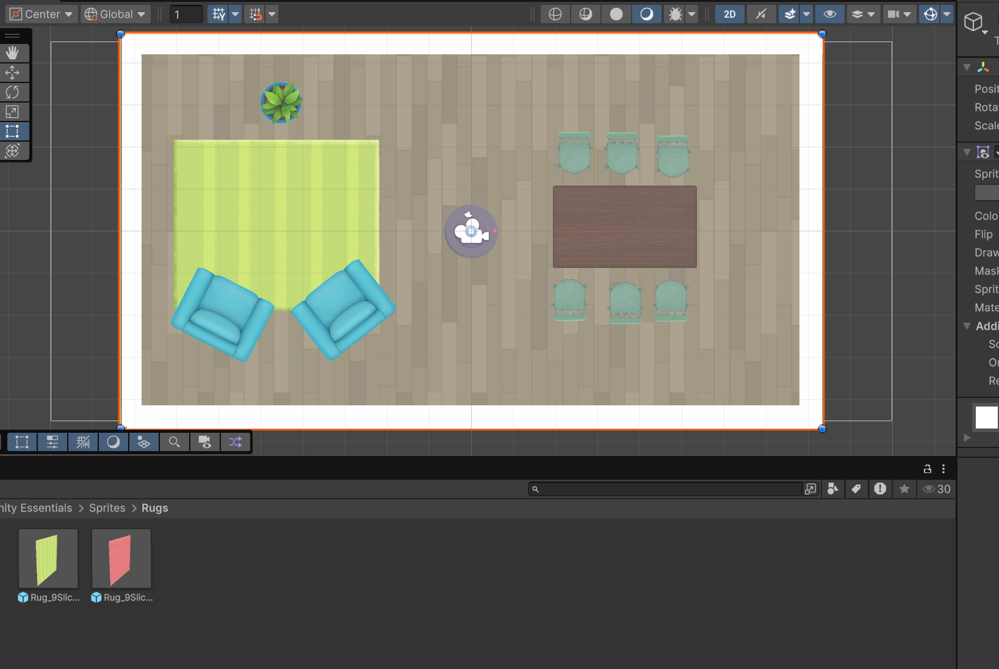
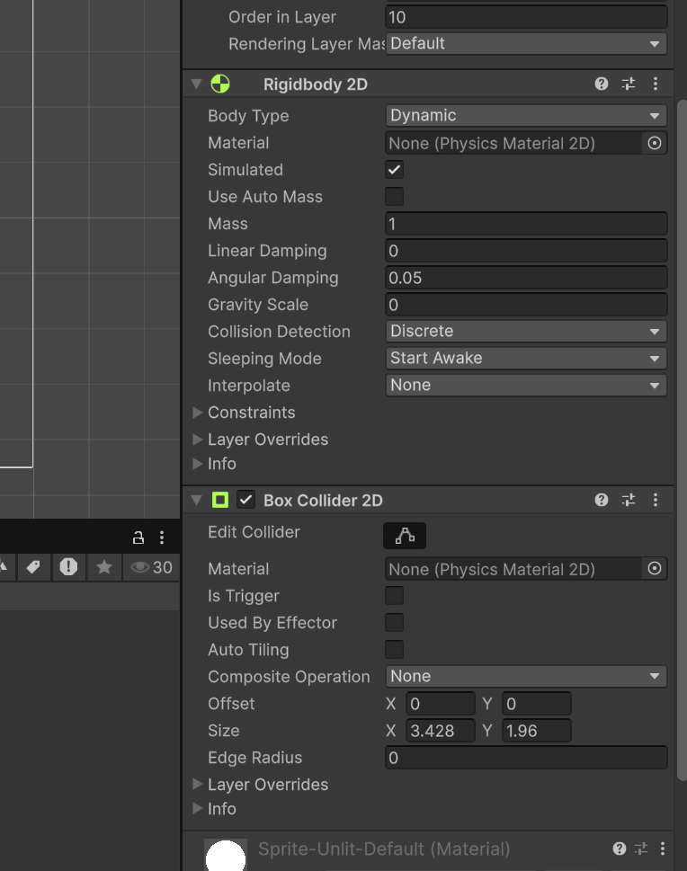

<h1>Creating a 2d game</h1>

Here we're going to make the same game in a room collecting collectables but in 2d, this process is similar to 3d but a bit more simple.

1. First I added some furniture sprites into the game with the vacuum robot in the middle (the player)

2. Next I added a rigidbody and a box collider, rigidbody is like interactable object through physical touch or maybe a player's or object's gravity. Ideal is to have rigit body with gravity on a platformer games but for example this one from a top down view you'd want gravity set to 0 otherwise the robot would be stuck on the floor level.

I also added circle and box colliders on the furniture so they are interactable and you would go through it like a ghost.

