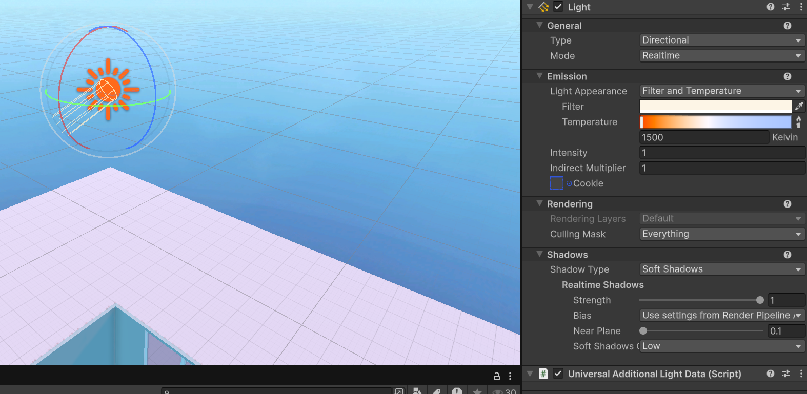
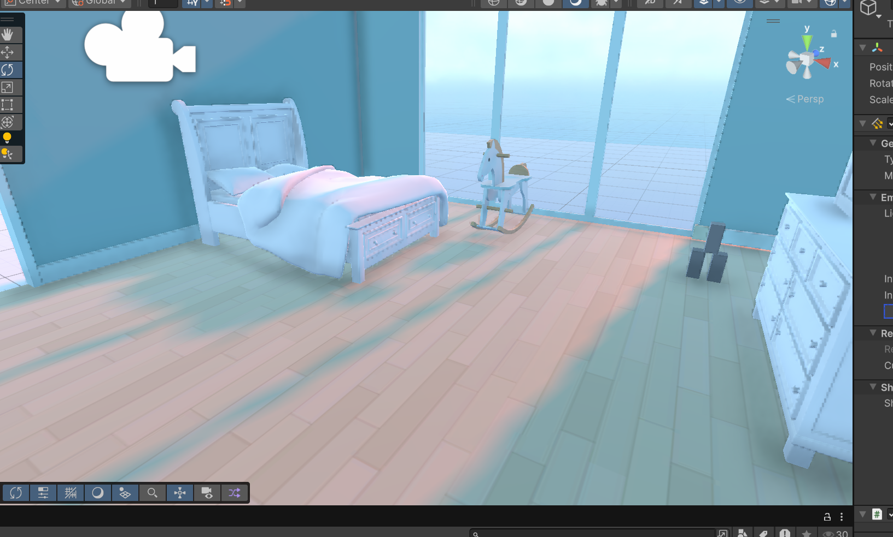
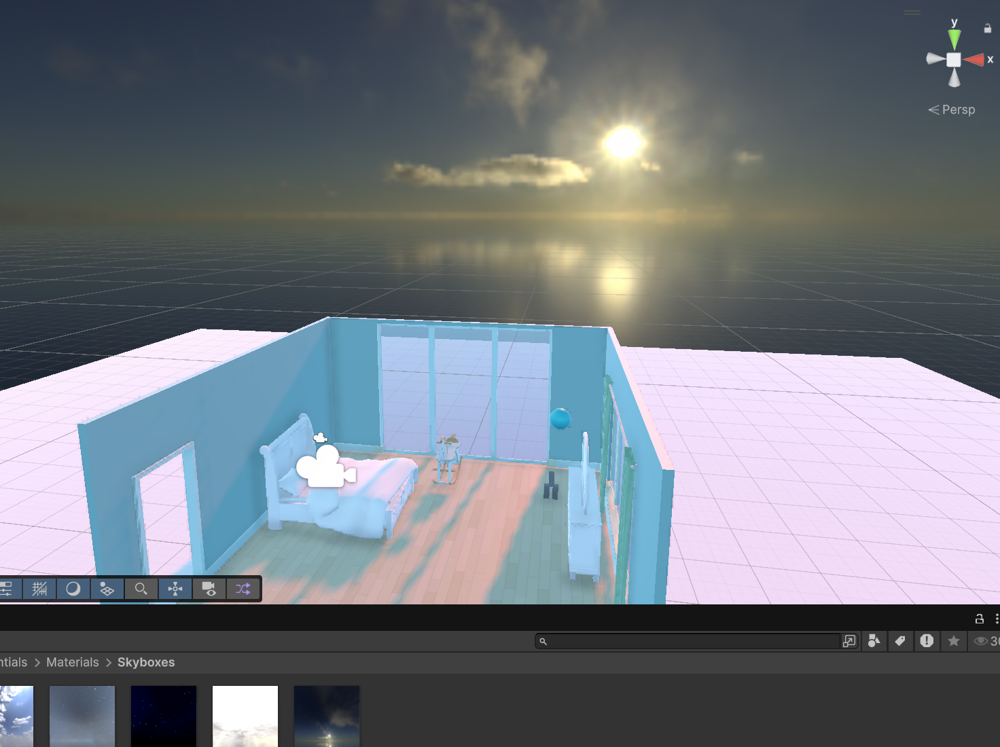

<h1>Creating light, camera and actions</h1>

Here I am going to edit the sun, sky and camera angle to get a perfect shot of a scene.

1. Changing the lighting, I first begun by changing the sun to a warm lighting something like a sunset and the sun direction coming through the windows

2. Here I changed the skybox to something more fitting with the lighting effect, there's only several skyboxes that came with Unity so I used the one that is the most fitting for the scene.

