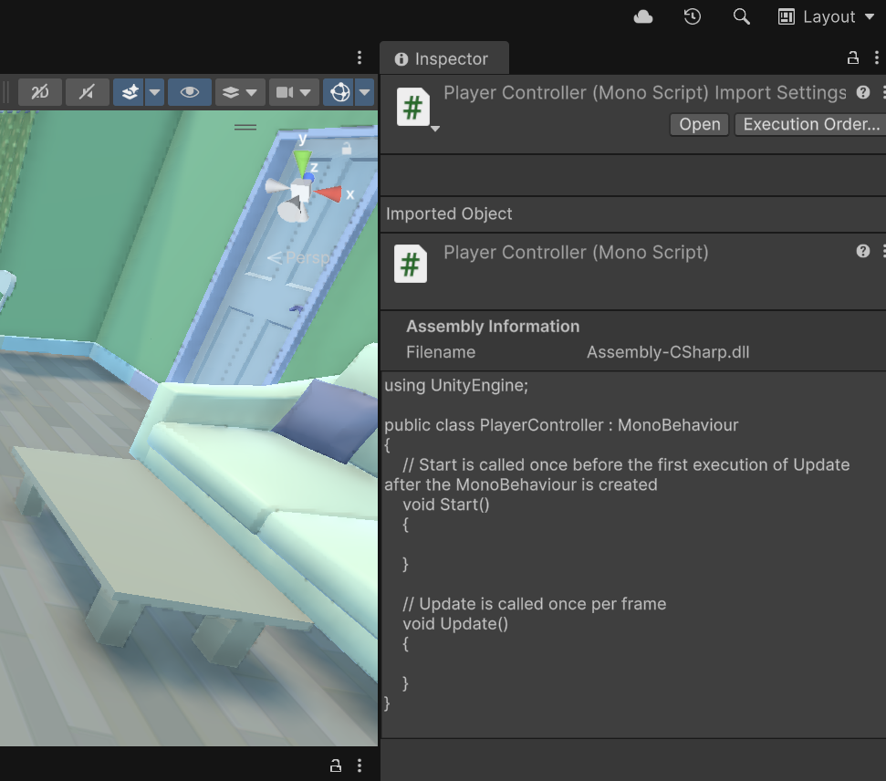
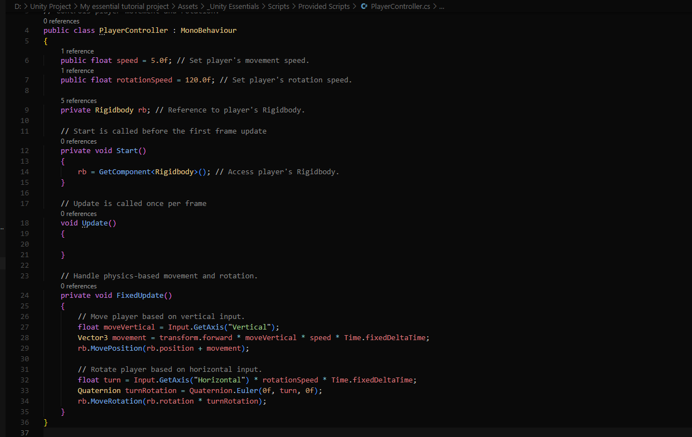
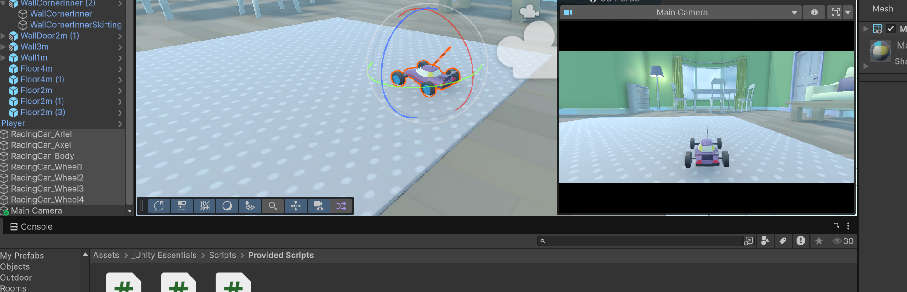
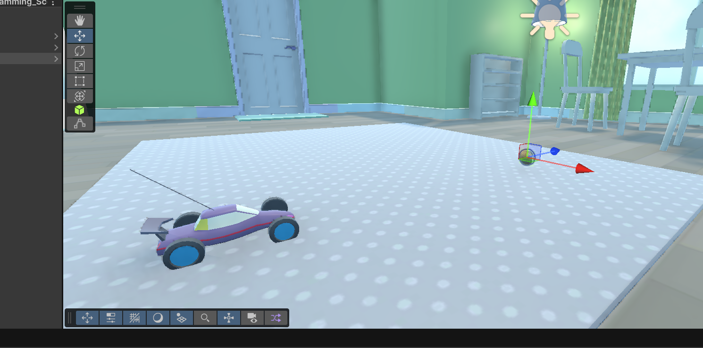
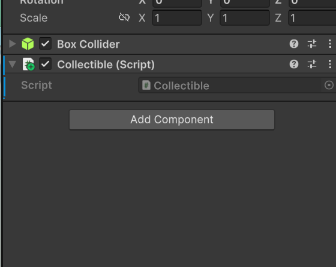
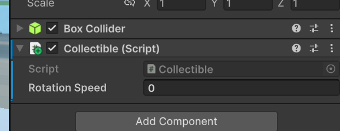
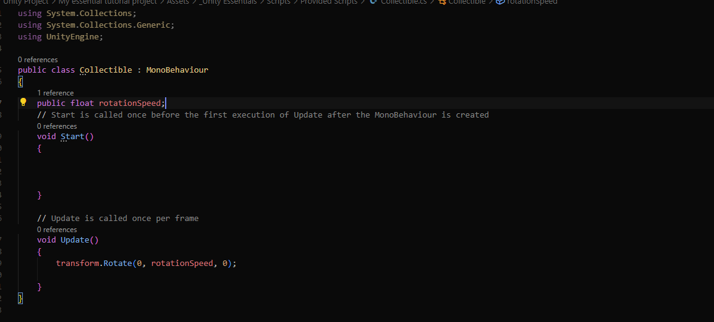

<h1>Scripting</h1>

<h1>Movement scripting</h1>

Here I am going to some movement scripting and other things like collecting objects in the map.

1. First I created a Monoscript, once I created it I dragged it into the player object (which is the car)

2. I editted the script and added this

3. After that I changed the main chamera to the back of the car for a better field of view

<h1>Collectables scripting</h1>

1. Here we put down a object coin that we want to turn into a collectable.

2. We create a mono script and add it to the coin game object

3. We put in a code so it has a rotation animation and I created a public float to make it easier to edit it

4. Here we start editing it as a collectable object, I scripted so that when you run over it it would destroy the object and create a VFX animation of a particle explosion as a indicator that you were able to collect it.